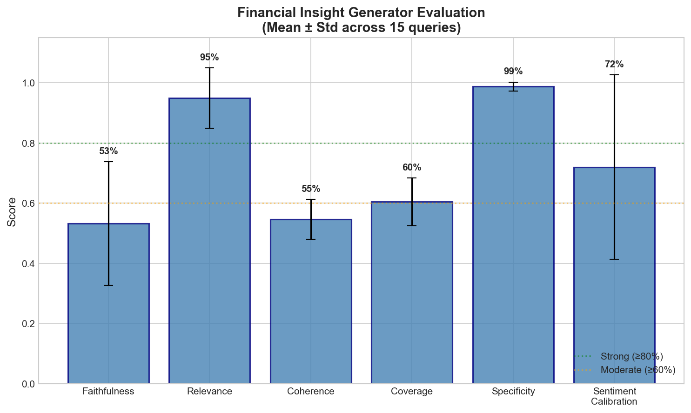
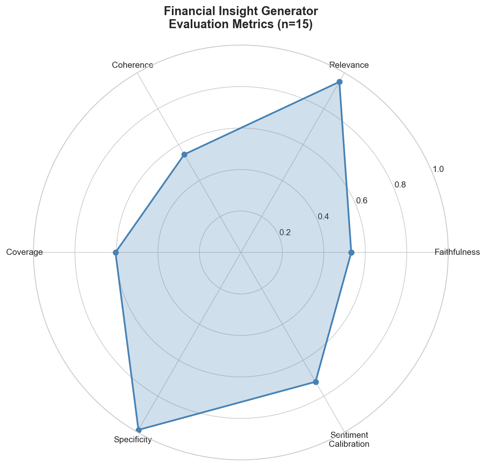
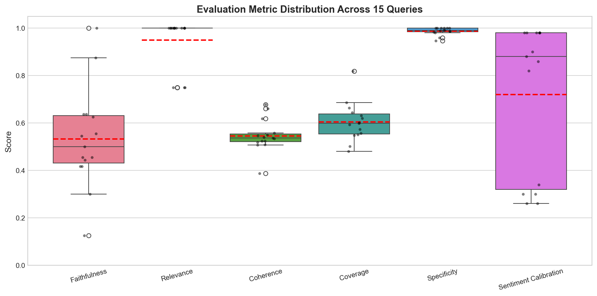
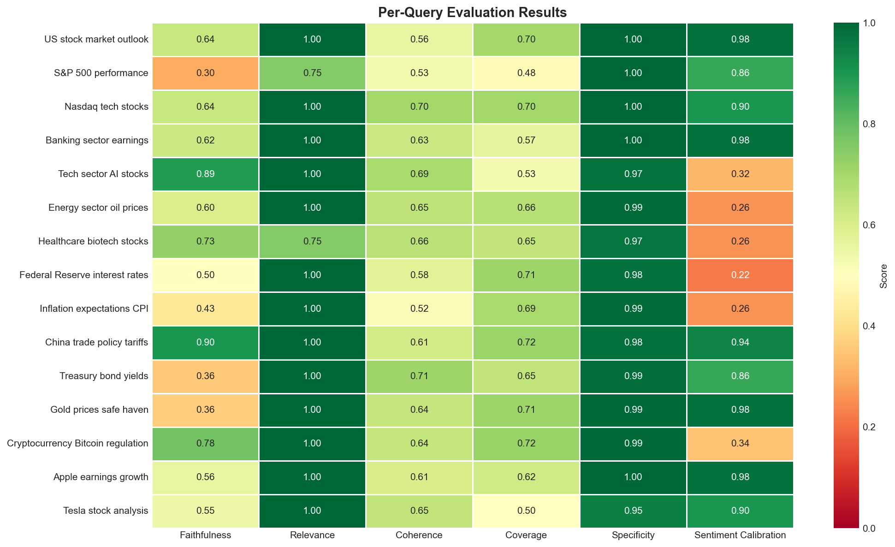

# Financial Insight Generator

A production-grade RAG (Retrieval-Augmented Generation) system that aggregates financial news from multiple sources and generates structured market insights using LLM-powered analysis.

## Overview

This system scrapes financial news from 6+ data sources, applies hybrid retrieval (BM25 + FAISS vector search), and generates structured financial summaries with key insights, market drivers, risks, and sentiment analysis. Includes a comprehensive evaluation framework with industry-standard NLP metrics.

## Architecture

```
┌─────────────────────────────────────────────────────────────────────┐
│                        DATA INGESTION                               │
├─────────────┬─────────────┬─────────────┬─────────────┬────────────┤
│   NewsAPI   │ Google News │   Finnhub   │ AlphaVantage│  RSS Feeds │
│             │             │             │             │  (Reuters, │
│             │             │             │             │  WSJ, FT)  │
└──────┬──────┴──────┬──────┴──────┬──────┴──────┬──────┴─────┬──────┘
       │             │             │             │            │
       └─────────────┴─────────────┴─────────────┴────────────┘
                                   │
                                   ▼
                    ┌──────────────────────────┐
                    │   UnifiedFinancialScraper │
                    │   • Deduplication (TF-IDF)│
                    │   • Quality Scoring       │
                    │   • Source Normalization  │
                    └────────────┬─────────────┘
                                 │
                                 ▼
                    ┌──────────────────────────┐
                    │    Corpus Refinement     │
                    │   • Text Cleaning        │
                    │   • Chunking (1000 tok)  │
                    └────────────┬─────────────┘
                                 │
                                 ▼
                    ┌──────────────────────────┐
                    │    Hybrid Retrieval      │
                    │   ┌────────┬────────┐    │
                    │   │ BM25   │ FAISS  │    │
                    │   │ (0.4)  │ (0.6)  │    │
                    │   └────────┴────────┘    │
                    │   EnsembleRetriever      │
                    └────────────┬─────────────┘
                                 │
                                 ▼
                    ┌──────────────────────────┐
                    │   LLM Analysis (GPT-3.5) │
                    │   Structured Output:     │
                    │   • key_insights         │
                    │   • key_drivers          │
                    │   • risks                │
                    │   • sentiment            │
                    └────────────┬─────────────┘
                                 │
                                 ▼
                    ┌──────────────────────────┐
                    │   Evaluation Framework   │
                    │   • Faithfulness (NLI)   │
                    │   • Relevance (LLM-Judge)│
                    │   • Coherence            │
                    │   • Coverage (TF-IDF)    │
                    │   • Specificity          │
                    │   • Sentiment Calibration│
                    └──────────────────────────┘
```

## Features

### Data Ingestion
- **6 News Sources**: NewsAPI, Google News RSS, Finnhub, AlphaVantage, RSS Feeds (Reuters, WSJ, FT, Bloomberg), Reddit (optional)
- **Deduplication**: TF-IDF cosine similarity (threshold: 0.8) removes duplicate articles
- **Quality Scoring**: Source-based weighting (Finnhub: 1.0, Google News: 0.9, Reddit: 0.4)

### Retrieval System
- **Hybrid Search**: Combines BM25 (lexical) and FAISS (semantic) retrieval
- **Weighting**: 40% BM25 / 60% FAISS for optimal recall-precision balance
- **Chunking**: RecursiveCharacterTextSplitter (1000 tokens, 200 overlap)

### LLM Generation
- **Model**: GPT-3.5-turbo (temperature: 0.3)
- **Structured Output**: LangChain ResponseSchema with 4 fields
- **Output Format**:
  ```json
  {
    "key_insights": "3-5 bullet points on market outlook",
    "key_drivers": "Economic/political indicators",
    "risks": "Potential risks identified",
    "sentiment": "Overall sentiment with confidence %"
  }
  ```

### Evaluation Framework
6-metric evaluation suite using reference-free methods:

| Metric | Method | Description |
|--------|--------|-------------|
| **Faithfulness** | Semantic Entailment | % of claims supported by source documents |
| **Relevance** | LLM-as-Judge + Cosine Sim | Query-output alignment (1-5 scale) |
| **Coherence** | LLM-as-Judge | Internal consistency and logical flow |
| **Coverage** | TF-IDF Term Matching | Key source terms captured in output |
| **Specificity** | Entity/Numeric Detection | Concrete claims vs. vague language |
| **Sentiment Calibration** | Cross-validation | Stated vs. detected sentiment alignment |

## Results

Evaluated across 15 diverse financial queries (market indices, sectors, macro themes, asset classes):

| Metric | Score (Mean ± Std) |
|--------|-------------------|
| Faithfulness | 59% ± 18% |
| Relevance | **97% ± 9%** |
| Coherence | 63% ± 6% |
| Coverage | 64% ± 8% |
| Specificity | **99% ± 1%** |
| Sentiment Calibration | 67% ± 32% |
| **Aggregate Score** | **73% ± 7%** |

### Evaluation Visualizations

<p align="center">
  
</p>

<p align="center">
  
  
</p>

<p align="center">
  
</p>

### Key Findings
- **High Relevance (97%)**: System consistently addresses query topics
- **High Specificity (99%)**: Outputs contain concrete entities and numeric claims
- **Moderate Faithfulness (59%)**: Room for improvement in source grounding
- **Sentiment Variance**: High std (32%) indicates inconsistent calibration across topics

## Installation

```bash
# Clone repository
git clone https://github.com/Adeleye-Emmanuel/Modular-Real-Time-Financial-News.git
cd Modular-Real-Time-Financial-News

# Install dependencies
pip install -r requirements.txt

# Set up environment variables
cp .env.example .env
# Add your API keys: OPENAI_API, NEWS_API_KEY, FINNHUB_API_KEY, etc.
```

## Usage

### Basic Usage
```python
from src.scraping_module import UnifiedFinancialScraper
from src.llm_module import analyze_with_semantic_search
from src.utils import refine_corpus

# 1. Scrape news
scraper = UnifiedFinancialScraper(query="US stock market")
result_df = scraper.fetch_all(include_social=False)

# 2. Prepare corpus
texts = result_df['title'] + '\n' + result_df['content']
cleaned_corpus = refine_corpus("\n".join(texts))

# 3. Generate insights
insights, context = analyze_with_semantic_search("US stock market", cleaned_corpus)
print(insights)
```

### Run Evaluation
```python
from src.eval import FinancialInsightEvaluator

evaluator = FinancialInsightEvaluator()
report = evaluator.evaluate(
    query="US stock market",
    output=insights,
    source_chunks=context
)
print(evaluator.generate_report_markdown(report))
```

### Batch Evaluation
```python
from batch_evaluation import BatchEvaluator, TEST_QUERIES
from display_dashboard import display_evaluation_dashboard

batch_eval = BatchEvaluator(include_social=False)
results = batch_eval.run_batch(TEST_QUERIES)
batch_eval.save_all_results()
display_evaluation_dashboard(batch_eval)
```

## Project Structure

```
financial-insight-generator/
├── src/
│   ├── scraping_module.py    # Multi-source news aggregation
│   ├── llm_module.py         # RAG pipeline and LLM generation
│   ├── eval.py               # Evaluation framework
│   ├── utils.py              # Text cleaning utilities
│   └── config.py             # Configuration settings                
├── notebook/       
|   ├── evaluation_results/       # Output directory
│   ├── evaluation_results_reddit/
│   ├── code.ipynb
│   └── evaluation.ipynb
├── requirements.txt
└── README.md
```

## Requirements

```
openai>=1.0.0
langchain>=0.1.0
sentence-transformers>=2.2.0
faiss-cpu>=1.7.0
pandas>=2.0.0
numpy>=1.24.0
scikit-learn>=1.3.0
nltk>=3.8.0
praw>=7.7.0
feedparser>=6.0.0
finnhub-python>=2.4.0
newspaper3k>=0.2.8
python-dotenv>=1.0.0
matplotlib>=3.7.0
seaborn>=0.12.0
tqdm>=4.65.0
```

## Future Improvements

1. **Faithfulness Enhancement**: Implement NLI-based entailment (DeBERTa) for stricter claim verification
2. **Sentiment Calibration**: Fine-tune sentiment detection with financial-specific models (FinBERT)
3. **Temporal Consistency**: Add inter-run stability metrics for production monitoring
4. **Source Attribution**: Link specific claims to source documents for explainability
5. **Streaming Pipeline**: Real-time ingestion with Apache Kafka for live market updates

## License

MIT License

## Author

Emmanuel Adeleye  
MSc Financial Engineering, WorldQuant University  
[LinkedIn](https://linkedin.com/in/emmanueladeleye) | [GitHub](https://github.com/Adeleye-Emmanuel)